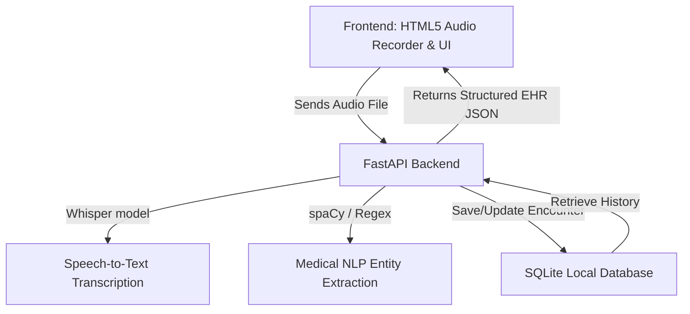

# ⚕️ MedScribe

> **MedScribe** is an ambient clinical audio summarizer and Electronic Health Record (EHR) auto-parser. It listens to clinical conversations between healthcare providers and patients, transcribes the speech, and uses NLP (Natural Language Processing) to extract key structured medical entities—such as symptoms, diagnoses, and prescriptions—generating structured clinical notes.

---

## 🚀 Features

- **Ambient Clinical Audio Transcription**: Transcribe patient-doctor audio files (supports WAV, MP3, WebM, M4A, OGG, AAC) using local Whisper speech-to-text models.
- **Structured Entity Extraction**: Extract patient names, encounter dates, symptoms, diagnoses, and prescriptions using spaCy NLP (or rule-based regex fallback).
- **Interactive EHR Editing**: View and modify the extracted details directly in the frontend UI.
- **EHR Database**: Keep a local history of clinical encounters in a lightweight SQLite database.
- **Export & Sync**: Auto-format and save encounters with Markdown summary notes.

---

## 🛠️ Architecture & Tech Stack



- **Frontend**: Vanilla HTML5, CSS3 (Modern Glassmorphism Design), Vanilla JavaScript (audio recording, real-time editing, search, history view).
- **Backend**: FastAPI (Python), Uvicorn (ASGI Server).
- **Database**: SQLite (managed with a custom lightweight wrapper).
- **Transcription**: OpenAI Whisper (local `tiny` model).
- **NLP Engine**: spaCy (`en_core_web_sm` model) with medical term dictionaries.

---

## 📂 Project Structure

```
MedScribe_Project/
├── backend/
│   ├── ai.py            # Whisper transcription & NLP entity extraction logic
│   ├── db.py            # SQLite database helper functions
│   ├── main.py          # FastAPI application & API endpoints
│   └── requirements.txt # Python dependency file
├── frontend/
│   ├── index.html       # Web application entry page
│   ├── style.css        # Responsive CSS layout & themes
│   └── app.js           # Audio recording and interactive UI state management
├── .gitignore           # File to ignore virtual env, SQLite DB, cache, etc.
├── run.py               # Launcher script for frontend and backend
└── test_backend.py      # Backend unit test suite
```

---

## 🏁 Getting Started

### 📋 Prerequisites

Ensure you have **Python 3.8+** installed on your system.

### 🔌 Installation

1. **Clone the repository** (or navigate to the workspace directory):
   ```bash
   cd MedScribe_Project
   ```

2. **Set up a Virtual Environment**:
   ```bash
   python3 -m venv .venv
   source .venv/bin/activate
   ```

3. **Install Dependencies**:
   ```bash
   pip install -r backend/requirements.txt
   ```
   *(Optional)* To enable full spaCy NLP, install the standard English model:
   ```bash
   python3 -m spacy download en_core_web_sm
   ```

---

## 🏃 Run the Application

You can launch the full application (both the frontend and backend servers) by running the launcher script:

```bash
python3 run.py
```

This launcher will:
- Spin up the **FastAPI + Uvicorn backend server** on `http://127.0.0.1:8000`.
- Serve the static frontend code.
- Automatically open `http://127.0.0.1:8000` in your default web browser.

---

## 🧪 API Endpoints

The backend provides the following REST API endpoints:

| Method | Endpoint | Description |
|:---|:---|:---|
| **POST** | `/api/transcribe` | Uploads an audio file and returns its transcription along with extracted EHR fields. |
| **GET** | `/api/encounters` | Retrieves all saved encounters. Supports query parameter `?search=query` for filtering. |
| **POST** | `/api/encounters` | Saves a new encounter record. |
| **PUT** | `/api/encounters/{id}` | Updates an existing encounter record. |
| **DELETE**| `/api/encounters/{id}` | Deletes an encounter record. |

---

## 📝 License

This project is licensed under the MIT License.
